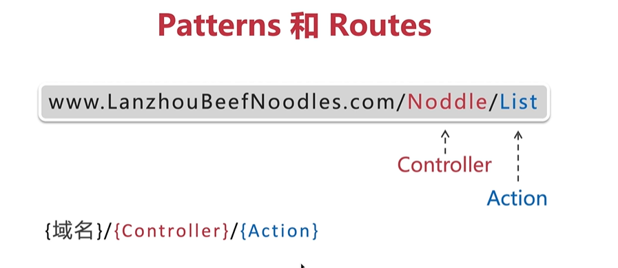

## 依赖管理

NuGet

就相当于Java的Maven，JavaScript的Npm

## appsettings.json


这里可以存储数据库连接字符串等配置

## Program.cs

程序入口，mian方法。

```c#
    public class Program
    {
        public static void Main(string[] args)
        {
            CreateHostBuilder(args).Build().Run();
        }

        public static IHostBuilder CreateHostBuilder(string[] args) =>
            Host.CreateDefaultBuilder(args)
                .ConfigureWebHostDefaults(webBuilder =>
                {
                    webBuilder.UseStartup<Startup>();
                });
    }
```

`CreateDefaultBuilder`主要做了四件事情：

加载主机和应用程序的配置信息；

是如何加载主机和应用程序的配置信息的呢？请看源码：

[MetaPackages/WebHost.cs at master · aspnet/MetaPackages (github.com)](https://github.com/aspnet/MetaPackages/blob/master/src/Microsoft.AspNetCore/WebHost.cs)


配置日志记录；

设置web服务器；

设置ASP .Net Core程序的托管形式；


## Startup.cs

用于项目运行配置，管理依赖注入、中间件、请求通道。

```c#
    public class Startup
    {
        // This method gets called by the runtime. Use this method to add services to the container.
        // For more information on how to configure your application, visit https://go.microsoft.com/fwlink/?LinkID=398940
        public void ConfigureServices(IServiceCollection services)
        {
        }

        // This method gets called by the runtime. Use this method to configure the HTTP request pipeline.
        public void Configure(IApplicationBuilder app, IWebHostEnvironment env)
        {
            if (env.IsDevelopment())
            {
                app.UseDeveloperExceptionPage();
            }

            app.UseRouting();

            app.UseEndpoints(endpoints =>
            {
                endpoints.MapGet("/", async context =>
                {
                    await context.Response.WriteAsync("Hello World!");
                });
            });
        }
    }
```

`ConfigureServices`

注入各种服务组件的依赖，这个方法是在.Net运行时被调用的。

注入内置组件

```c#
        public void ConfigureServices(IServiceCollection services)
        {
            services.AddMvc();//注入内置的组件
        }
```


`Configure`用于设置中间件，Http请求通道。

`Configure`方法中的`IWebHostEnvironment`参数：虚拟主机的环境变量。在实际开发中我们常常要将环境分为开发环境、集成测试环境、用户测试环境、预发布环境、生产环境。那么这个环境是如何进行配置的呢？可以在`launchSettings.json`中进行配置。


## wwwroot


存放前端静态文件

## 项目运行


## launchSettings.json


配置端口、开发环境、测试环境、生产环境等配置。

## 什么是Http请求通道呢


在请求传递的过程中，首先我们得检查请求（检查用户是否登录、检查URL是否正确、访问出错的时候该如何抛出异常等等）。在，HTTP是由`Configure`函数中的中间件（Middleware）处理。


## 中间件

中间件就是组装到应用程序管道中，用来处理请求和相应的软件，Asp .Net Core内置了很多中间件。

举个例子：


例如创建一个映射URL的中间件，并运行查看效果。


## 理解路由

ASP .Net Core路由系统。

先想想服务器是如何服务文件的？

不妨在想想，一个文件是如何被打开的，首先我们有一个文件服务器，里面存放着各种各样的文件，第一步我们先使用浏览器向服务发出请求，请求以URL的形式向服务器请求文件1（File1），然后服务器拿到URL后会向本地文件进行映射，如果文件被找到，那么这个文件就会以HTTP的形式返回前端，这样我们就可以看到文件内容了。


那么HTTP又是如何被处理的呢？

- 传统服务器的路由

传统的服务器处理HTTP请求很黄很暴力，他会直接在服务器上直接检索文件，如果文件物理存在的话，就直接简单粗暴的返回这个文件。也就是说传统的路由，必须满足以下两点：


但是如果用传统的路由会出现很尴尬的事情，比如无法服务动态的文件。另外一件尴尬的事情就是文件必须带有后缀，比如html、jsp等，就会在某些程度上暴露技术栈，还会暴露服务器的文件结构。

- ASP.Net MVC路由

ASP.Net MVC路由就是为了解决传统路由尴尬的事情所设计的，ASP.Net MVC路由有如下特点：


ASP.Net MVC路由处理过程：


------

那么ASP.Net MVC路由Patterns：




## 定义URL和Controller之间的映射规则

ASP.Net MVC路由会使用中间件`app.UseMvcWithDefaultRoute()`，映射默认路由：


怎么看下来ASP.Net MVC路由好简单啊，但是为什么？

其实实现这个路由很复杂，先来看下如果要映射这个路由，该如何写代码。


## 两种路由映射模式

- 传统路由（使用路由表）Conventional routing
- 特性注释路由 Attribute routing

这两种模式可以互相兼容，互相嵌套。

**Conventional routing**


**Attribute routing**


自定义路由


等号后面接着的home，index代表打开的页面控制器为home控制器，使用的是index，而id后面跟着一个问号表示该参数是可选的。

## 数据模型与仓库模式 2022.08.30

### 数据模型的基本概念

简单地说就是一个类（class），即映射数据库，对象话数据。其作用是获取数据、更新数据、传递数据、保存数据等。还有这个说法也没问题：模型用于处理业务逻辑，视为Business Layer业务层。

比如说，我们的网站为了实现用户注册的功能，我们首先得有一个user model。user model中定义了许多的属性，比如用户的id，姓，名，邮箱等，这些属性可能会和数据库进行映射，有些属性则不用映射，比如 UserName 。


在模型上除了定义属性的模型外，还可以定义业务逻辑，例如下面这个业务就是用户通过邮箱注册账号之后，用户会收到一封带有超链接并且超链接附带有token的邮件。


### 数据仓库的基本用法

> 如何从数据库中获取数据？
>
> - JDBC
> - Ado.Net
> - ORM

这里我们使用repository仓库模式从数据库中获取数据。

①创建视图模型

```c#
namespace LanZhouBeefNoodles.Models
{
    public class Noodle
    {
        public int Id { get; set; }
        public string Name { get; set; }
        public string ShortDescription { get; set; }
        public string LongDescription { get; set; }
        public decimal Price { get; set; }
        public string ImageURL { get; set; }
    }
}

```


②创建仓库接口

```c#
using System.Collections.Generic;

namespace LanZhouBeefNoodles.Models
{
    public interface INoodleRepository
    {
        IEnumerable<Noodle> GetAllNoodles();
        Noodle GetNoodleById(int id);
    }
}

```


Mock数据

```c#
using System.Collections.Generic;

namespace LanZhouBeefNoodles.Models
{
    public class MockNoodleRepository : INoodleRepository
    {
        private List<Noodle> _noodleList;

        public MockNoodleRepository()
        {
            if (_noodleList == null)
            {
                InitializeNoodle();
            }
        }

        private void InitializeNoodle()
        {
            _noodleList = new List<Noodle>
            {
                new Noodle { Id = 1, Name = "毛细", Price = 12, ShortDescription = "如发丝般细", LongDescription = "真的好细好细好细啊", ImageURL="/images/毛细.png"},
                new Noodle { Id = 2, Name = "细", Price = 10, ShortDescription = "普通细", LongDescription = "还是挺细的", ImageURL="/images/细.png"},
                new Noodle { Id = 3, Name = "三细", Price = 11, ShortDescription = "有点粗了", LongDescription = "比细的粗点，比二细细点", ImageURL="/images/三细.png"},
                new Noodle { Id = 4, Name = "二细", Price = 10, ShortDescription = "粗了", LongDescription = "粗的才有嚼劲", ImageURL="/images/二细.png"},
                new Noodle { Id = 5, Name = "二柱子", Price = 11, ShortDescription = "太粗了", LongDescription = "粗得快咬不动了", ImageURL="/images/二柱子.png"},
                new Noodle { Id = 6, Name = "韭叶子", Price = 12, ShortDescription = "扁的", LongDescription = "韭猜叶一样宽", ImageURL="/images/韭叶子.png"},
                new Noodle { Id = 7, Name = "薄宽", Price = 11, ShortDescription = "开始宽了", LongDescription = "比韭叶宽一点，比大宽窄一点", ImageURL="/images/薄宽.png"},
                new Noodle { Id = 8, Name = "大宽", Price = 10, ShortDescription = "裤带面", LongDescription = "比嘴还宽了", ImageURL="/images/大宽.png"},
                new Noodle { Id = 9, Name = "荞麦棱子", Price = 15, ShortDescription = "立方体的", LongDescription = "好像知道师傅怎么拉出来的", ImageURL="/images/荞麦棱子.png"},
                new Noodle { Id = 10, Name = "一窝丝", Price = 15, ShortDescription = "这是啥", LongDescription = "我也没吃过", ImageURL="/images/一窝丝.png"}
            };
        }

        public IEnumerable<Noodle> GetAllNoodles()
        {
            return _noodleList;
        }

        public Noodle GetNoodleById(int id)
        {
            return _noodleList.Find(x => x.Id == id);
        }
    }
}

```


### 视图数据绑定

```html
@model IEnumerable<LanZhouBeefNoodles.Models.Noodle>
@{
    ViewData["Title"] = "Index";
}

<h2>Index</h2>

@foreach (var noodle in Model)
{
    <div>
        <p>@noodle.Name</p>
        <p>@noodle.Price</p>
        <p>@noodle.ShortDescription</p>
    </div>
}
```


### 数据验证

### MVVM vs MVC


## Entity Framework Core 2022.08.31

**特点：**

1. 跨平台
2. 建模
3. 允许我们使用linq，即查询、更改、保存数据等
4. 并发
5. 事务
6. 缓存
7. 数据迁移

**EF的组件（红色部分）**：


### 创建和修改数据模型

无论是创建还是修改，都需要安装好拓展包：


#### 创建

**step1** build项目

**step2** 在程序包管理器控制台输入：`add-migration {描述}` ，创建好之后，文件目录将新增如下文件夹和文件


**step3** 程序包管理器控制台输入 `update-datebase`

**step4** 向数据库录入初始化数据。在models文件夹中新增 DbInitializer.cs 文件

```c#
using System;
using System.Collections.Generic;
using System.Linq;
using System.Threading.Tasks;

namespace LanZhouBeefNoodles.Models
{
    public static class DbInitializer
    {
        public static void Seed(AppDbContext context)
        {
            if (context.Noodles.Any())
            {
                return;
            }
            context.AddRange
                (
                new Noodle { Name = "毛细", Price = 12, ShortDescription = "如发丝般细", LongDescription = "真的好细好细好细啊", ImageUrl = "/images/毛细.png" },
                new Noodle { Name = "细", Price = 10, ShortDescription = "普通细", LongDescription = "还是挺细的", ImageUrl = "/images/细.png" },
                new Noodle { Name = "三细", Price = 11, ShortDescription = "有点粗了", LongDescription = "比细的粗点，比二细细点", ImageUrl = "/images/三细.png" },
                new Noodle { Name = "二细", Price = 10, ShortDescription = "粗了", LongDescription = "粗的才有嚼劲", ImageUrl = "/images/二细.png" },
                new Noodle { Name = "二柱子", Price = 11, ShortDescription = "太粗了", LongDescription = "粗得快咬不动了", ImageUrl = "/images/二柱子.png" },
                new Noodle { Name = "韭叶子", Price = 12, ShortDescription = "扁的", LongDescription = "韭猜叶一样宽", ImageUrl = "/images/韭叶子.png" },
                new Noodle { Name = "薄宽", Price = 11, ShortDescription = "开始宽了", LongDescription = "比韭叶宽一点，比大宽窄一点", ImageUrl = "/images/薄宽.png" },
                new Noodle { Name = "大宽", Price = 10, ShortDescription = "裤带面", LongDescription = "比嘴还宽了", ImageUrl = "/images/大宽.png" },
                new Noodle { Name = "荞麦棱子", Price = 15, ShortDescription = "立方体的", LongDescription = "好像知道师傅怎么拉出来的", ImageUrl = "/images/荞麦棱子.png" },
                new Noodle { Name = "一窝丝", Price = 15, ShortDescription = "这是啥", LongDescription = "我也没吃过", ImageUrl = "/images/一窝丝.png" }
                );
            context.SaveChanges();
        }
    }
}

```

**step5** 修改启动函数，在重新启动前检测是否有初始化数据，如果没有则录入初始化数据。

```c#
        public static void Main(string[] args)
        {
            //CreateHostBuilder(args).Build().Run();

            var host = CreateHostBuilder(args).Build();
            using (var scope = host.Services.CreateScope())
            {
                var services = scope.ServiceProvider;
                try
                {
                    var context = services.GetRequiredService<AppDbContext>();
                    DbInitializer.Seed(context);
                }
                catch (Exception)
                {
                    //故意留空，以后可以添加日志
                }
            }
            host.Run();
        }
```

**step6** 运行项目即可。

#### 更新

**step1** 在模型中更新字段

**step2** 在程序包管理器控制台输入：`add-migration {描述}`

**step3** 程序包管理器控制台输入 `update-datebase`

## 视图 2022.09.03

Views文件夹和视图模板文件设置

视图的种类与基本操作

视图的页面美化

